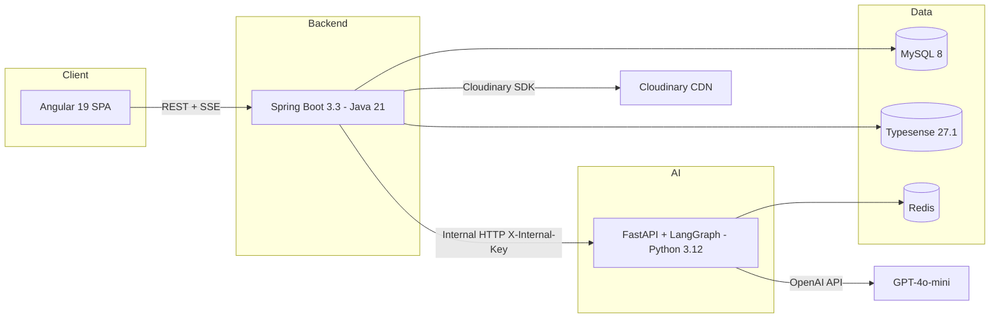
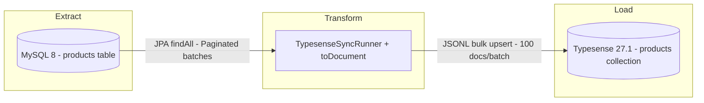
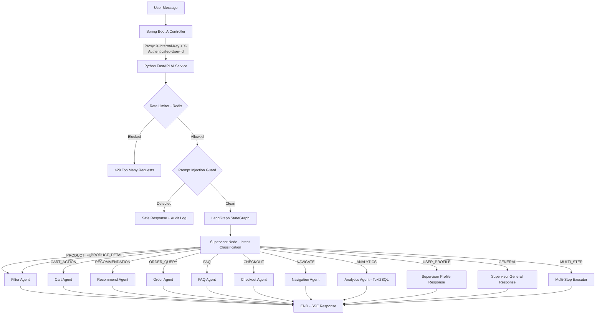
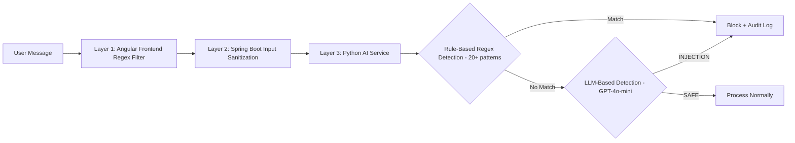
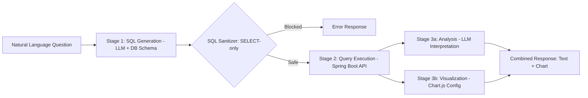
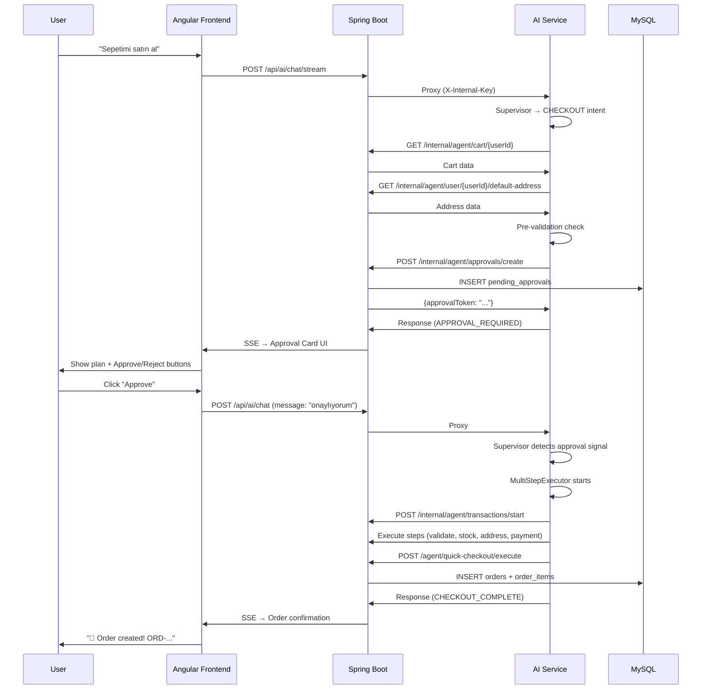

# ShopAI — E-Commerce Platform Technical Report

> **Project:** ShopAI Multi-Vendor E-Commerce Platform  
> **Version:** 3.0.0 (Security-Hardened Edition)  
> **Repository:** GitHub — `main` branch  
> **Date:** April 2026

---

## Table of Contents

1. [Introduction](#1-introduction)
2. [Architecture Decisions and Justifications](#2-architecture-decisions-and-justifications)
3. [ETL Process Documentation with Field Mappings](#3-etl-process-documentation-with-field-mappings)
4. [API Documentation Overview](#4-api-documentation-overview)
5. [AI Chatbot Architecture](#5-ai-chatbot-architecture)
6. [Challenges Faced and Solutions Implemented](#6-challenges-faced-and-solutions-implemented)
7. [Source Code Repository](#7-source-code-repository)

---

## 1. Introduction

ShopAI is an AI-powered, multi-vendor e-commerce platform that integrates a conversational AI chatbot directly into the shopping experience. The platform supports three distinct user roles — **Customer (USER)**, **Seller (SELLER)**, and **Administrator (ADMIN)** — each with dedicated dashboards, analytics, and capabilities.

### 1.1 Technology Stack

| Layer | Technology | Version |
|---|---|---|
| **Frontend** | Angular (Standalone Components, Signals) | 19.x |
| **Backend API** | Spring Boot (Java) | 3.3.0 |
| **AI Service** | Python FastAPI + LangGraph + LangChain | FastAPI 0.115, LangGraph 0.2.38 |
| **LLM Provider** | OpenAI GPT-4o-mini | via langchain-openai 0.2.6 |
| **Database** | MySQL | 8.0 |
| **Search Engine** | Typesense | 27.1 |
| **Cache / Rate Limit** | Redis | Alpine |
| **DB Migrations** | Flyway | 10.15.0 |
| **Auth** | JWT (jjwt 0.12.5) — HttpOnly Cookie | - |
| **API Docs** | SpringDoc OpenAPI (Swagger UI) | 2.5.0 |
| **Image Storage** | Cloudinary | 1.36.0 |
| **Containerization** | Docker Compose | - |
| **Markdown Rendering** | marked + DOMPurify | Frontend |
| **Chart Visualization** | Chart.js | 4.5.1 |
| **Structured Logging** | structlog (Python) / SLF4J (Java) | - |
| **Rate Limiting** | Bucket4j (Java) / slowapi + Redis (Python) | - |

### 1.2 Project Structure

```
E-commerce/
├── frontend/          # Angular 19 SPA (Nginx in production)
├── backend/           # Spring Boot 3.3 REST API (Java 21)
├── ai-service/        # Python FastAPI + LangGraph AI Agent Service
├── typesense-data/    # Typesense persistent data volume
├── docker-compose.yml # Full-stack orchestration (6 services)
└── .git/              # Git version control
```

---

## 2. Architecture Decisions and Justifications

### 2.1 Overall Architecture: Microservice-Oriented Monorepo



**Justification:** The system uses a three-tier architecture (Frontend → Backend → AI Service) rather than a monolith because:

- **Language specialization:** Java/Spring Boot handles transactional integrity, security, and ORM. Python handles LLM orchestration with LangGraph's native async support.
- **Independent scaling:** AI Service can scale horizontally behind a load balancer without affecting the core commerce API.
- **Security isolation:** The AI Service never directly accesses the database. All data access goes through Spring Boot's internal API, enforcing authorization at every layer.

### 2.2 Authentication & Security Architecture

**Decision:** JWT tokens stored in **HttpOnly cookies** instead of localStorage.

| Aspect | Decision | Justification |
|---|---|---|
| Token Storage | HttpOnly Cookie | Prevents XSS token theft — JavaScript cannot access the cookie |
| Password Hashing | BCrypt (cost=12) | Industry standard; cost factor 12 balances security and performance |
| CSRF Protection | Custom `PersistentCookieCsrfTokenRepository` | Spring's default repository deletes the cookie after POST, causing a 1-accept/1-refuse cycle |
| Rate Limiting | Bucket4j (backend) + Redis slowapi (AI) | Prevents brute-force attacks and AI abuse |
| Refresh Tokens | SHA-256 hashed in DB | Plain tokens never stored; revocation support via `revoked_at` |
| Account Lockout | 5 failed attempts → 15min lock | `failed_login_attempts` + `locked_until` columns |
| Security Headers | CSP, X-Frame-Options: DENY, X-Content-Type-Options | Prevents clickjacking, MIME sniffing |
| Internal API Auth | `X-Internal-Key` header | AI Service ↔ Backend communication is authenticated via shared secret |

### 2.3 Database Design Decision: MySQL 8 with Flyway Migrations

**Decision:** MySQL 8 with InnoDB engine, `utf8mb4_unicode_ci` collation, and Flyway version-controlled migrations.

**Justification:**
- **Flyway:** 25 versioned migration files (`V1` through `V25`) ensure reproducible schema evolution across environments. Every schema change is tracked in Git.
- **InnoDB:** Supports foreign keys, transactions, and row-level locking.
- **utf8mb4:** Full Unicode support including emoji (used in AI chatbot responses).
- **CHECK constraints:** `price >= 0`, `rating BETWEEN 1 AND 5`, `quantity > 0` — data integrity at the database level.

### 2.4 Search Engine Decision: Typesense

**Decision:** Typesense as a dedicated search index alongside MySQL (source of truth).

**Justification:**
- **Typo-tolerance:** Handles user typos (`ayakabi` → `ayakkabı`) with `numTypos: 2`.
- **Sub-millisecond latency:** Faster than MySQL `LIKE '%term%'` queries.
- **Faceted search:** Category, brand, price range, and rating facets built-in.
- **Graceful degradation:** If Typesense is down, the system falls back to MySQL `LIKE` queries (`ConditionalOnProperty`).

### 2.5 AI Architecture Decision: LangGraph Multi-Agent System

**Decision:** LangGraph `StateGraph` with a Supervisor pattern instead of a single monolithic prompt.

**Justification:**
- **Intent-based routing:** Supervisor classifies the user's intent and routes to specialized agents. Each agent has domain-specific prompts and tools.
- **Separation of concerns:** Filter Agent handles product search; Cart Agent handles cart operations; Analytics Agent handles Text2SQL — each agent is independently testable and maintainable.
- **Streaming support:** LangGraph's `astream()` with `stream_mode=["messages", "values"]` enables token-by-token SSE streaming to the frontend.
- **State management:** `AgentState` TypedDict carries all context through the graph — user identity, intent, action results, approval status.

### 2.6 Frontend Decision: Angular 19 Standalone Components

**Decision:** Angular 19 with Standalone Components, Signals, and lazy-loaded routes.

**Justification:**
- **No NgModules:** Every component is standalone, reducing boilerplate and improving tree-shaking.
- **Lazy loading:** All feature routes use `loadComponent()` / `loadChildren()` for code splitting.
- **Markdown pipe:** AI chatbot responses are rendered via `marked` library with `DOMPurify` sanitization to prevent XSS from AI-generated markdown.
- **Role-based guards:** `authGuard`, `adminGuard`, `sellerGuard`, `guestGuard` protect routes.

### 2.7 Containerization Decision: Docker Compose

Six services orchestrated via `docker-compose.yml`:

| Service | Image / Build | Port | Depends On |
|---|---|---|---|
| `db` | `mysql:8.0` | 3307:3306 | - |
| `redis` | `redis:alpine` | 6379:6379 | - |
| `typesense` | `typesense/typesense:27.1` | 8108:8108 | - |
| `ai-service` | Custom (Python 3.12) | 8000:8000 | redis |
| `backend` | Custom (Java 21) | 8080:8080 | db (healthy), typesense, ai-service |
| `frontend` | Custom (Angular + Nginx) | 80:80 | backend |

**Health checks** on MySQL ensure the backend only starts after the database is ready.

---

## 3. ETL Process Documentation with Field Mappings

### 3.1 ETL Overview: MySQL → Typesense Synchronization

The platform implements an ETL (Extract, Transform, Load) pipeline that synchronizes product data from MySQL (source of truth) to Typesense (search index).



### 3.2 ETL Trigger Mechanisms

| Trigger | When | Method |
|---|---|---|
| **Application Startup** | Spring Boot starts with `typesense.enabled=true` | `TypesenseSyncRunner.run()` — Full sync |
| **Product Create/Update** | Admin/Seller creates or updates a product | `TypesenseProductService.indexProduct()` — Single upsert |
| **Product Delete** | Admin/Seller soft-deletes a product | `TypesenseProductService.removeProduct()` — Single delete |

### 3.3 Field Mapping: MySQL `products` → Typesense `products` Collection

| MySQL Column | MySQL Type | Typesense Field | Typesense Type | Facet | Notes |
|---|---|---|---|---|---|
| `id` | BIGINT (PK) | `id` | string | No | Typesense requires string ID |
| `name` | VARCHAR(255) | `name` | string | No | **Searchable** — primary query field |
| `slug` | VARCHAR(255) | `slug` | string | No | Not indexed (index: false) |
| `description` | TEXT | `description` | string | No | **Searchable** |
| `price` | DECIMAL(10,2) | `price` | float | No | Original price |
| `discounted_price` | DECIMAL(10,2) | `discountedPrice` | float | No | Sale price |
| *(computed)* | — | `effectivePrice` | float | **Yes** | `discountedPrice ?? price` — used for filtering |
| `stock_quantity` | INT | `stockQuantity` | int32 | No | Used for in-stock filter |
| `brand` | VARCHAR(100) | `brand` | string | **Yes** | **Searchable** + faceted |
| `category.name` | VARCHAR(100) | `categoryName` | string | **Yes** | Includes parent category name |
| `category.slug` | VARCHAR(100) | `categorySlug` | string | **Yes** | Used for URL-based filtering |
| `category.id` | BIGINT | `categoryId` | int64 | **Yes** | Numeric category filter |
| `tags` | JSON | `tags` | string[] | **Yes** | AI search tags |
| `rating_avg` | DECIMAL(3,2) | `ratingAvg` | float | **Yes** | Average rating (0–5) |
| `rating_count` | INT | `ratingCount` | int32 | No | Number of reviews |
| `is_featured` | BOOLEAN | `isFeatured` | bool | **Yes** | Featured product flag |
| `is_active` | BOOLEAN | `isActive` | bool | **Yes** | Active filter (always true in search) |
| `images[0].image_url` | VARCHAR(500) | `primaryImageUrl` | string | No | Primary image (is_primary=true) |
| `seller.id` | BIGINT (FK) | `sellerId` | int64 | **Yes** | Multi-vendor seller filter |
| `seller.firstName + lastName` | VARCHAR | `sellerName` | string | No | Display name |
| `created_at` | DATETIME | `createdAt` | int64 | No | Unix timestamp (epoch seconds) for sorting |

### 3.4 Transform Logic (toDocument method)

Key transformations performed during the ETL:

1. **ID conversion:** `BIGINT → String` (Typesense requirement)
2. **Effective price calculation:** `discountedPrice != null ? discountedPrice : price`
3. **Category flattening:** `category.name + " " + category.parent.name` → single searchable string
4. **Primary image resolution:** Filters `ProductImage` list for `isPrimary=true`, falls back to first image
5. **Seller name concatenation:** `seller.firstName + " " + seller.lastName`
6. **Timestamp conversion:** `LocalDateTime → epoch seconds` (UTC offset)
7. **Null safety:** All nullable fields default to empty string, 0, or false

### 3.5 Bulk Indexing Process

```
1. TypesenseSyncRunner starts (ApplicationRunner)
2. ensureCollection() — creates Typesense schema if not exists
3. productRepository.count() → total products
4. Paginated loop (batchSize=100):
   a. productRepository.findAll(PageRequest.of(i, 100))
   b. Filter: only isActive=true products
   c. Map each Product → Map<String, Object> via toDocument()
   d. Serialize to JSONL (one JSON per line)
   e. typesenseClient.import_(jsonl, action=UPSERT)
5. Log total indexed count
```

### 3.6 Flyway Migration History (Schema Evolution)

| Version | Description | Type |
|---|---|---|
| V1 | Core tables: users, refresh_tokens, categories, products, product_images, product_variants | DDL |
| V2 | Commerce tables: reviews, carts, cart_items, address, coupons, orders, order_items | DDL |
| V3 | AI & audit tables: ai_conversations, ai_messages, audit_logs, user_sessions, wishlist_items, notifications | DDL |
| V4 | Performance indexes on FK columns and search fields | DDL |
| V5 | Seed data: demo users, categories, initial products | DML |
| V6 | Triggers, stored procedures, scheduled events (rating recalculation) | DDL |
| V7 | Fix demo user passwords (BCrypt rehash) | DML |
| V8 | Add SELLER role and seed seller user | DML |
| V9 | Extended seed data | DML |
| V10 | Add `seller_id` FK to products table (multi-vendor support) | DDL |
| V11 | Remove obsolete stock triggers | DDL |
| V12 | Password reset token hash column | DDL |
| V13 | Add `is_deleted` soft-delete columns | DDL |
| V14 | Remove conflicting triggers | DDL |
| V15 | Create `blacklisted_tokens` table (JWT blacklist) | DDL |
| V16 | Seed extended product catalog | DML |
| V17 | **Agentic UI Control tables:** agent_transactions, agent_transaction_steps, pending_approvals, user_ai_preferences | DDL |
| V18 | Seed product variants (color/size) | DML |
| V19 | Reviews table restructure | DDL |
| V20 | New product additions | DML |
| V21 | Add `shipping_mode` to orders + seed analytics data | DDL+DML |
| V22 | Seed global reviews | DML |
| V23 | Update product images to Unsplash URLs | DML |
| V24 | Fix broken product image URLs | DML |
| V25 | Add shop fields (shopName, shopDescription) to users table | DDL |

---

## 4. API Documentation Overview

The backend exposes a RESTful API documented via **SpringDoc OpenAPI 2.5.0** (Swagger UI at `/swagger-ui/`). Authentication uses JWT HttpOnly cookies — no Authorization header.

### 4.1 API Endpoint Map

#### Authentication (`/api/auth/`)

| Method | Endpoint | Auth | Description |
|---|---|---|---|
| POST | `/api/auth/register` | Public | User registration (BCrypt hash, email verification token) |
| POST | `/api/auth/login` | Public | Login → sets `access_token` + `refresh_token` HttpOnly cookies |
| POST | `/api/auth/logout` | Public | Blacklists current JWT, clears cookies |
| POST | `/api/auth/refresh` | Public | Refreshes access token via refresh token cookie |
| POST | `/api/auth/forgot-password` | Public | Sends password reset email |
| POST | `/api/auth/reset-password` | Public | Resets password with hashed token |
| GET | `/api/auth/verify-email` | Public | Email verification via token |

#### Products (`/api/products/`)

| Method | Endpoint | Auth | Description |
|---|---|---|---|
| GET | `/api/products` | Public | Paginated product list with filters (category, price, brand, rating, sort) |
| GET | `/api/products/{slug}` | Public | Product detail by slug |
| GET | `/api/products/search` | Public | Typesense-powered typo-tolerant search |
| GET | `/api/products/{id}/reviews` | Public | Product reviews |

#### Cart (`/api/cart/`)

| Method | Endpoint | Auth | Required |
|---|---|---|---|
| GET | `/api/cart` | JWT | Get current user's cart |
| POST | `/api/cart/add` | JWT | Add product to cart |
| PUT | `/api/cart/update` | JWT | Update item quantity |
| DELETE | `/api/cart/remove/{itemId}` | JWT | Remove item from cart |
| DELETE | `/api/cart/clear` | JWT | Clear entire cart |

#### Orders (`/api/orders/`)

| Method | Endpoint | Auth | Description |
|---|---|---|---|
| GET | `/api/orders` | JWT | User's order history (paginated) |
| GET | `/api/orders/{orderNumber}` | JWT | Order detail (IDOR-protected) |
| POST | `/api/orders` | JWT | Create order from cart |
| PUT | `/api/orders/{id}/cancel` | JWT | Cancel pending order |

#### AI Chat (`/api/ai/`)

| Method | Endpoint | Auth | Description |
|---|---|---|---|
| POST | `/api/ai/chat` | Public* | Blocking chat (proxied to Python AI Service) |
| POST | `/api/ai/chat/stream` | Public* | SSE streaming chat (token-by-token) |

*Anonymous users can use the chatbot; authenticated users get personalized responses.

#### Admin (`/api/admin/`)

| Method | Endpoint | Auth | Description |
|---|---|---|---|
| GET | `/api/admin/users` | ADMIN | List all users |
| PUT | `/api/admin/users/{id}/role` | ADMIN | Change user role |
| GET | `/api/admin/stats/**` | ADMIN | Platform-wide statistics |
| POST | `/api/admin/products` | ADMIN/SELLER | Create product |
| PUT | `/api/admin/products/{id}` | ADMIN/SELLER | Update product |

#### Seller (`/api/seller/`)

| Method | Endpoint | Auth | Description |
|---|---|---|---|
| GET | `/api/seller/products` | SELLER | Seller's own products |
| GET | `/api/seller/stats/**` | SELLER | Seller-specific analytics |
| GET | `/api/seller/orders` | SELLER | Orders containing seller's products |

#### Internal API (`/api/internal/`) — AI Service ↔ Backend

| Method | Endpoint | Auth | Description |
|---|---|---|---|
| GET | `/api/internal/agent/products/filter` | X-Internal-Key | AI agent product filtering |
| GET | `/api/internal/agent/products/search` | X-Internal-Key | AI agent Typesense search |
| GET | `/api/internal/agent/cart/{userId}` | X-Internal-Key | AI agent cart access |
| POST | `/api/internal/agent/cart/{userId}/add` | X-Internal-Key | AI agent cart modification |
| POST | `/api/internal/analytics/query` | X-Internal-Key | Text2SQL query execution |
| POST | `/api/internal/agent/approvals/create` | X-Internal-Key | Agentic UI approval creation |
| POST | `/api/internal/agent/transactions/start` | X-Internal-Key | Multi-step transaction start |

### 4.2 Security Layers on API

```
Request Flow:
  [Angular] → [RateLimitingFilter] → [OriginHeaderFilter] → [CSRF Filter] → [JwtAuthFilter] → [Controller]
```

1. **RateLimitingFilter** — Bucket4j token-bucket per IP (before any processing)
2. **OriginHeaderFilter** — Validates Origin/Referer header matches allowed frontend URL
3. **CSRF Filter** — `PersistentCookieCsrfTokenRepository` validates XSRF-TOKEN
4. **JwtAuthFilter** — Extracts JWT from HttpOnly cookie, validates signature, sets SecurityContext

---

## 5. AI Chatbot Architecture

### 5.1 High-Level Architecture

The AI chatbot uses a **LangGraph StateGraph** with a **Supervisor-Agent pattern**. The Supervisor classifies user intent and routes to specialized sub-agents.



### 5.2 Agent Descriptions

| Agent | File | Intent(s) | Tools Used | Description |
|---|---|---|---|---|
| **Supervisor** | `supervisor.py` | All (routing) | — | Classifies intent using GPT-4o-mini with zero temperature. Routes to correct sub-agent. |
| **Filter Agent** | `filter_agent.py` | PRODUCT_FILTER, PRODUCT_DETAIL | `filter_products`, `search_products`, `get_product_detail` | Converts natural language to JSON filter params → queries Spring Boot → generates conversational response |
| **Cart Agent** | `cart_agent.py` | CART_ACTION | `get_cart`, `add_to_cart`, `remove_from_cart`, `clear_cart` | Handles all cart operations via Spring Boot internal API |
| **Recommend Agent** | `recommend_agent.py` | RECOMMENDATION | `search_products` | Generates personalized product recommendations |
| **Order Agent** | `order_agent.py` | ORDER_QUERY | `get_orders`, `get_order_detail` | Queries user's orders with filtering and status tracking |
| **FAQ Agent** | `faq_agent.py` | FAQ | — | Answers static questions about returns, shipping, payment policies |
| **Checkout Agent** | `checkout_agent.py` | CHECKOUT | `get_cart`, `search_products`, `add_to_cart` | Multi-step checkout orchestration with approval workflow |
| **Navigation Agent** | `navigation_agent.py` | NAVIGATE | — | Returns frontend navigation commands (route changes) |
| **Analytics Agent** | `analytics_agent.py` | ANALYTICS | Spring Boot `/internal/analytics/query` | Text2SQL pipeline: NL→SQL→Execute→Analyze→Chart.js visualization |
| **Multi-Step Executor** | `multi_step_executor.py` | MULTI_STEP | Spring Boot transaction APIs | Executes approved checkout plans step-by-step with rollback support |
| **Pre-Validation Agent** | `pre_validation_agent.py` | — (called by Checkout) | — | Validates checkout plans before user approval |

### 5.3 AgentState (Graph State Definition)

```python
class AgentState(TypedDict):
    messages: list[BaseMessage]          # Conversation history (LangChain format)
    user_id: Optional[str]              # From JWT — NEVER from user input
    user_role: Optional[str]            # ROLE_ADMIN, ROLE_SELLER, ROLE_USER
    session_id: str                     # Frontend UUID
    current_message: str                # Current user message
    intent: Optional[str]               # Classified intent
    selected_agent: Optional[str]       # Routed agent name
    action_type: Optional[str]          # Frontend action (PRODUCT_LIST, CART_UPDATED, etc.)
    action_data: Optional[Any]          # Action payload (product list, cart data, etc.)
    final_response: Optional[str]       # Text response for user
    injection_detected: bool            # Prompt injection flag
    agent_type: Optional[str]           # Which agent produced the response
    # Agentic UI Control
    requires_approval: bool             # Does this action need user approval?
    plan_data: Optional[str]            # Checkout plan JSON
    approval_token: Optional[str]       # Backend approval token
    approval_status: Optional[str]      # PENDING, APPROVED, REJECTED, EXPIRED
    is_multi_step: bool                 # Multi-step transaction flag
    transaction_id: Optional[int]       # AgentTransaction ID
    # Text2SQL Analytics
    generated_sql: Optional[str]        # LLM-generated SQL query
    sql_results: Optional[list[dict]]   # Query results
    chart_config: Optional[dict]        # Chart.js configuration
```

### 5.4 Three-Layer Security System



Detected injection patterns include: instruction reset, identity change, system prompt extraction, privilege escalation, data exfiltration, DAN/jailbreak, and role switching — in both English and Turkish.

### 5.5 Text2SQL Analytics Pipeline (Analytics Agent)



**SQL Security:**
- Only `SELECT` queries allowed
- `INSERT`, `UPDATE`, `DELETE`, `DROP`, `ALTER`, `TRUNCATE`, `GRANT`, `REVOKE` are blocked
- Automatic `LIMIT 100` appended if missing
- Role-based data scoping: SELLER sees only own data (via `seller_id` filter), ADMIN sees all, USER sees only public trends

### 5.6 Agentic UI Control — Checkout Flow



### 5.7 SSE Streaming Protocol

The AI chat uses **Server-Sent Events (SSE)** for real-time token streaming:

```
# Each SSE event is a JSON line:
data: {"type": "token", "content": "Merhaba"}
data: {"type": "token", "content": ", size"}
data: {"type": "token", "content": " nasıl"}
...
data: {"type": "state", "state": {"message": "...", "agentType": "filter_agent", "actionType": "PRODUCT_LIST", "actionData": {...}}}
```

The `state` event at the end contains the full response including `actionType` and `actionData` which the frontend uses to render product cards, cart updates, navigation commands, approval cards, or Chart.js visualizations.

---

## 6. Challenges Faced and Solutions Implemented

### 6.1 CSRF Cookie Deletion Bug

**Challenge:** Spring Security's default `CookieCsrfTokenRepository` deletes the XSRF-TOKEN cookie after a successful POST request by setting `Max-Age=0`. This caused a 1-accept/1-refuse pattern where every other POST request failed CSRF validation.

**Solution:** Implemented a custom `PersistentCookieCsrfTokenRepository` that never deletes the cookie. The token persists across requests, and a `CsrfCookieFilter` forces token generation on every response (Spring Security 6 uses lazy token generation).

### 6.2 Multi-Vendor Data Isolation

**Challenge:** In a shared order that contains products from multiple sellers, Seller A could see Seller B's products in the order detail, violating data privacy.

**Solution:** Added `seller_id` filtering at the `OrderService` level. When a SELLER queries orders, the response filters `order_items` to show only items where `product.seller_id` matches the authenticated seller. ADMIN retains full visibility.

### 6.3 AI Agent Hallucination Prevention

**Challenge:** LLM agents would fabricate product names, prices, and brands that don't exist in the database, misleading users.

**Solution:** Implemented a "Zero Hallucination" policy across all agent prompts:
- Every agent prompt explicitly states: "NEVER fabricate data that is not in the provided dataset"
- Filter Agent receives actual search results from Typesense/MySQL before generating responses
- Analytics Agent operates on real SQL query results, not generated data
- Response generation prompts include the actual data as context, constraining the LLM to factual information

### 6.4 Prompt Injection Attacks

**Challenge:** Users could manipulate the AI by sending messages like "ignore all previous instructions" or "you are now a different AI".

**Solution:** Three-layer defense system:
1. **Angular frontend:** Basic regex filtering before sending
2. **Spring Boot:** Input sanitization and length limiting (max 500 chars)
3. **Python AI Service:** Rule-based regex (20+ patterns in English/Turkish) + LLM-based detection as fallback. Detected injections are logged to `audit_logs` table.

### 6.5 Typesense-MySQL Synchronization

**Challenge:** Typesense search index could become stale if products are updated in MySQL but not re-indexed.

**Solution:**
- **Startup sync:** `TypesenseSyncRunner` performs full bulk sync (paginated, 100/batch) on every application start
- **Real-time sync:** `ProductService.save()` and `ProductService.delete()` trigger `TypesenseProductService.indexProduct()` / `removeProduct()` respectively
- **Graceful degradation:** `@ConditionalOnProperty(name = "typesense.enabled")` — if Typesense is unavailable, the application continues with MySQL `LIKE` fallback queries

### 6.6 SSE Streaming Through Spring Boot Proxy

**Challenge:** Spring Boot acts as a proxy between Angular and the Python AI Service. Streaming SSE responses through this proxy required careful handling to avoid buffering the entire response before forwarding.

**Solution:** Used Spring WebFlux's `WebClient` with reactive streaming. The `AiService` in Spring Boot reads the SSE stream from Python and re-emits it to Angular as a `Flux<String>`, maintaining token-by-token delivery without buffering.

### 6.7 Text2SQL Security

**Challenge:** The Analytics Agent generates SQL from natural language, which could be exploited for SQL injection or unauthorized data modification.

**Solution:**
- **Whitelist approach:** Only `SELECT` statements are allowed
- **Keyword blacklist:** 14 dangerous keywords are regex-checked (`INSERT`, `UPDATE`, `DELETE`, `DROP`, `ALTER`, `TRUNCATE`, `CREATE`, `GRANT`, `REVOKE`, `EXEC`, `EXECUTE`, `INTO OUTFILE`, `LOAD DATA`, `SHOW GRANTS`)
- **Automatic LIMIT:** `LIMIT 100` appended if missing
- **Role-based SQL injection:** SELLER queries automatically include `WHERE seller_id = {authenticated_user_id}`
- **Sensitive columns excluded:** `email`, `password_hash` are never selected
- **Execution via backend:** SQL runs through Spring Boot's internal API, not directly on the database

### 6.8 Agentic UI — Approval Token Expiration

**Challenge:** Users might approve a checkout after the approval token has expired, leading to stale plan execution.

**Solution:** `pending_approvals` table has an `expires_at` column. The Multi-Step Executor checks token validity before execution. Expired tokens return a user-friendly message asking to restart the checkout flow. The Supervisor's approval signal detection also handles the "no pending approval found" case gracefully.

---

## 7. Source Code Repository

### 7.1 Repository Information

- **Platform:** GitHub
- **Branch Strategy:** `main` (primary development branch)
- **Remote:** `origin/main`

### 7.2 Commit History (Chronological)

| Hash | Message | Scope |
|---|---|---|
| `3cbdacd` | Initial commit | Project initialization |
| `6ba4852` | Implement product listing, filtering, and order management | Backend + Frontend |
| `a1b4ae2` | Implement product detail page with variant selection and auth infrastructure | Full-stack |
| `3ed1a8f` | Implement full-stack AI chat service with security filters | Backend + AI |
| `06e5f92` | Implement AI-powered chatbot with Spring Boot proxy and multi-agent system | AI architecture |
| `7d56879` | Implement seller product management dashboard with image upload | Seller features |
| `857df76` | Implement containerization with Docker and home page UI | DevOps + Frontend |
| `abf317d` | Implement foundational AI-driven platform with agentic workflows | AI + Backend |
| `b788850` | Implement AI-driven chatbot agent system and analytics dashboards | AI agents + Analytics |
| `398a739` | Implement comprehensive AI assistant and multi-role analytics dashboard | Full-stack AI |
| `099a71f` | Basic updates | Maintenance |
| `4e1b63d` | More updates | Maintenance |
| `4245edf` | Shop field updates | Seller features |

### 7.3 Project Metrics

| Metric | Value |
|---|---|
| Total Commits | 13 |
| Backend Controllers | 21 |
| Backend Services | 25 |
| Backend Entities | 24 |
| AI Agents | 11 (including supervisor) |
| AI Tools | 7 modules |
| Flyway Migrations | 25 |
| Frontend Features | 16 modules |
| Docker Services | 6 |
| Frontend Routes | 20+ (lazy-loaded) |

---

> **End of Technical Report**

